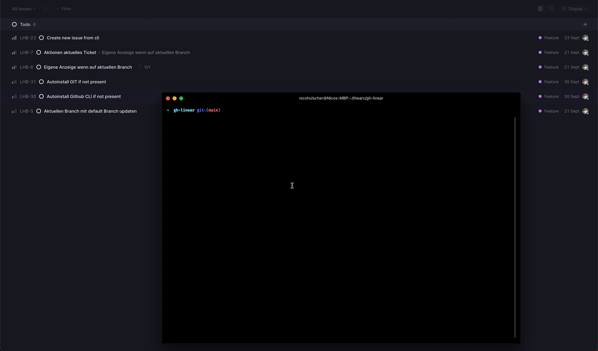

# linhub




## Install

```bash
$ npm install --global linhub
```


## CLI

```
$ lh --help

  Usage
    $ linhub // or
    $ lh
    $ h
    $ lin
```

Options
```
  -t, --ticket string          Directly start working on a ticket (ex lh -t SPR-12)
  -f, --find string            Search for tickets
  --add-reviewer string[]      Add reviewers - adds them as default if only flag
  --remove-reviewer string[]   Remove reviewers - adds them from default if only flag
  -i, --i                      Show only my tickets
  -r, --ready                  Mark related PR as ready for review
  -c, --code-review            Start codereview by assigning default reviewers or passed
  -m, --merge                  Merge the related pr
  -h, --help                   Prints this usage guide
  -s, --status                 Shows the status of the current branch/ticket
  -v, --version                Prints the version of this package
  -u, --update                 Updates to the latest version
  -w, --web                    Open the PR on Github
```
